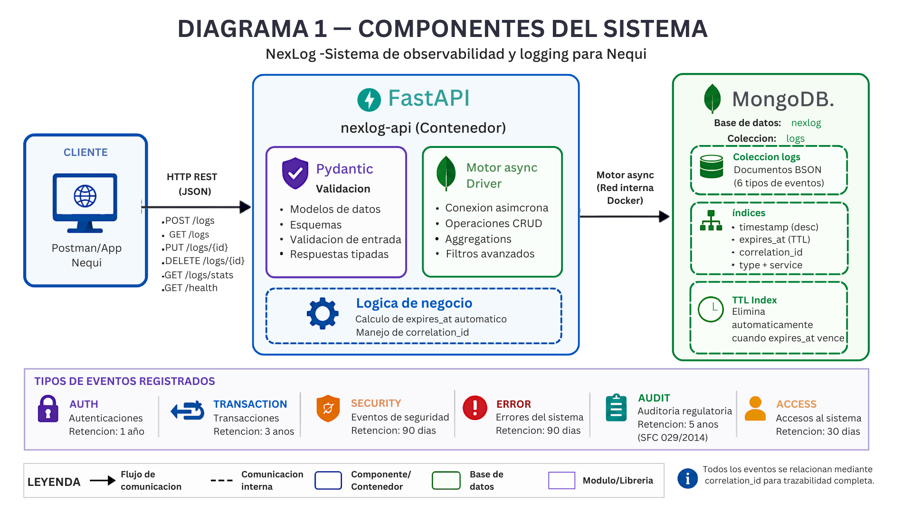
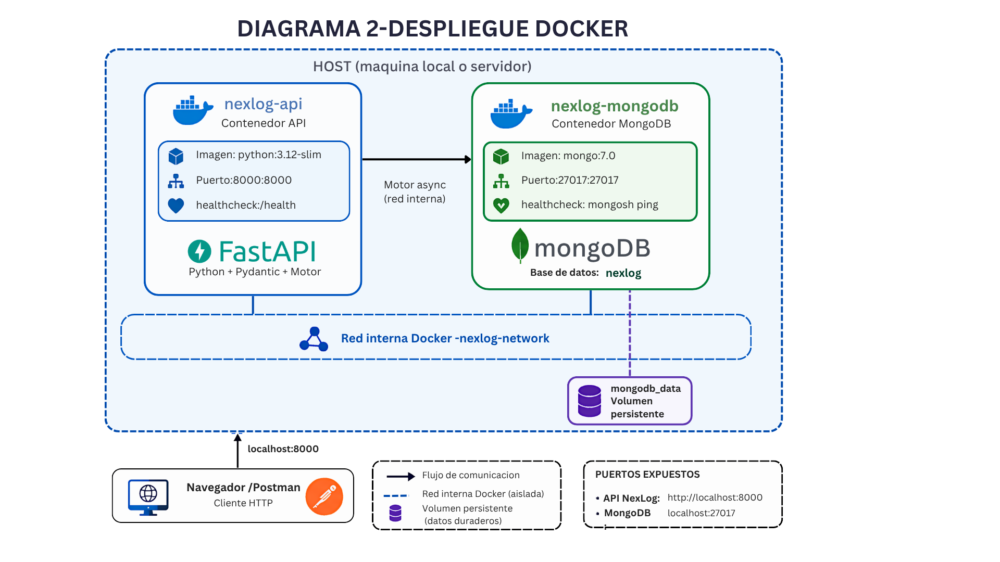
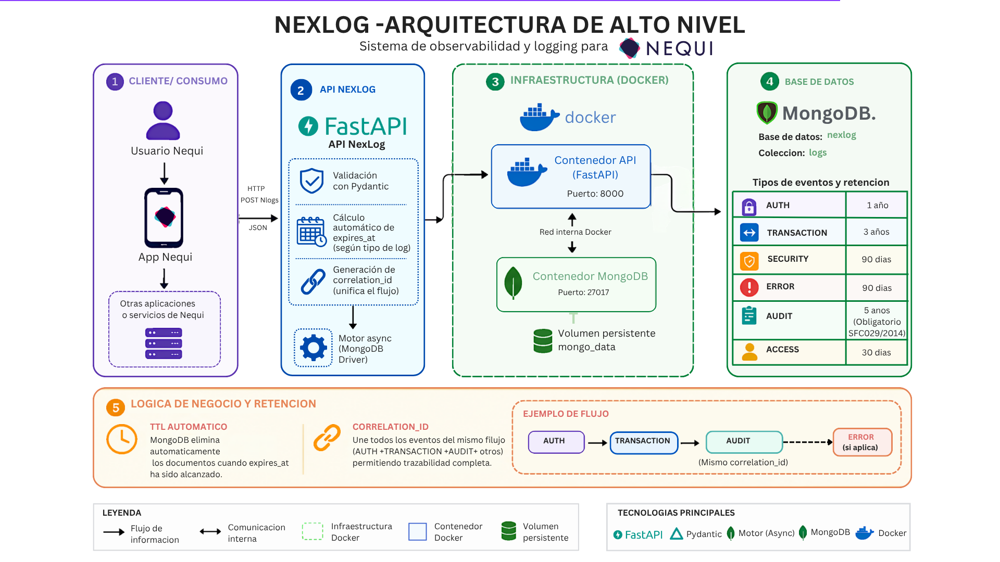

# NexLog — Sistema de Observabilidad para Fintech

> Sistema de logging y trazabilidad de alta disponibilidad para **Nequi** (Bancolombia). Registra, almacena y expone 6 tipos de eventos del ciclo de vida de una operación financiera con retención diferenciada por tipo, cumplimiento regulatorio SFC 029/2014 y pipeline de carga automatizado.

---

## Tabla de contenido

- [Descripción general](#descripción-general)
- [Arquitectura](#arquitectura)
- [Stack tecnológico](#stack-tecnológico)
- [Requisitos del sistema](#requisitos-del-sistema)
- [Instalación paso a paso](#instalación-paso-a-paso)
- [Levantamiento con Docker](#levantamiento-con-docker)
- [Pipeline de carga completo](#pipeline-de-carga-completo-run_load_testsh)
- [Endpoints de la API](#endpoints-de-la-api)
- [Filtros disponibles](#filtros-disponibles-en-get-apiv1logs)
- [Tipos de log y retención](#tipos-de-log-y-política-de-retención)
- [Tests](#tests)
- [Tests de carga con k6 — salida esperada](#tests-de-carga-con-k6--salida-esperada)
- [GitHub Actions CI/CD](#github-actions-cicd)
- [Estructura del proyecto](#estructura-del-proyecto)
- [Variables de entorno](#variables-de-entorno)
- [Comandos Docker útiles](#comandos-docker-útiles)
- [Decisiones técnicas](#decisiones-técnicas)
- [Microservicios de Nequi](#microservicios-de-nequi)
- [Equipo](#equipo)
- [Regulación aplicable](#regulación-aplicable)

---

## Descripción general

NexLog resuelve un problema real de las Fintech colombianas: tener un registro unificado y auditable de todas las operaciones críticas, desde que un usuario abre la app de Nequi hasta que su transacción queda confirmada o rechazada.

Cada evento genera un documento en MongoDB con un `correlation_id` único que permite rastrear toda la traza de una operación a través de múltiples microservicios. El endpoint `/traza/{correlation_id}` devuelve el flujo completo ordenado cronológicamente.

**Capacidad estimada:** hasta 500.000 eventos/hora en producción con Motor async.

---

## Arquitectura

### Diagrama 1 — Componentes del sistema


### Diagrama 2 — Despliegue Docker


### Diagrama 3 — Flujo de alto nivel


---

## Stack tecnológico

| Componente       | Tecnología              | Versión   | Justificación                                      |
|------------------|-------------------------|-----------|----------------------------------------------------|
| API              | FastAPI                 | 0.115.0   | Alto rendimiento, soporte async nativo             |
| Driver MongoDB   | Motor (async)           | 3.5.1     | No bloquea el event loop bajo alta concurrencia    |
| Validación       | Pydantic                | 2.8.2     | Tipos estrictos, serialización automática          |
| Servidor ASGI    | Uvicorn                 | 0.30.6    | Servidor de producción para FastAPI                |
| Base de datos    | MongoDB                 | 7.0       | Esquema flexible, TTL Index nativo, alta escritura |
| Contenedores     | Docker + Compose        | latest    | Entorno reproducible en cualquier máquina          |
| CI/CD            | GitHub Actions          | —         | Automatización de tests en cada PR                 |
| Tests unitarios  | pytest + httpx          | 8.3.2     | Tests async sin levantar servidor real             |
| Tests de carga   | k6 (Grafana)            | latest    | Simulación de 85 VUs concurrentes                 |
| Variables env    | python-dotenv           | 1.0.1     | Configuración sin credenciales en el código        |

---

## Requisitos del sistema

Antes de clonar el proyecto, verifica que tienes instalado todo lo siguiente:

### Software obligatorio

| Herramienta      | Versión mínima | Verificación              | Descarga                                        |
|------------------|----------------|---------------------------|-------------------------------------------------|
| **Git**          | 2.x            | `git --version`           | https://git-scm.com/downloads                   |
| **Docker**       | 24.x           | `docker --version`        | https://www.docker.com/products/docker-desktop  |
| **Docker Compose**| 2.x           | `docker compose version`  | Incluido con Docker Desktop                     |
| **Python**       | 3.11 o 3.12    | `python --version`        | https://www.python.org/downloads/               |
| **pip**          | 23.x+          | `pip --version`           | Incluido con Python                             |

> **Nota:** MongoDB **no necesita instalación local**. Corre completamente dentro del contenedor Docker.

### Recursos mínimos de hardware

| Recurso | Mínimo      | Recomendado  |
|---------|-------------|--------------|
| RAM     | 4 GB        | 8 GB         |
| CPU     | 2 núcleos   | 4 núcleos    |
| Disco   | 5 GB libres | 10 GB libres |

### Puertos requeridos

Asegúrate de que los siguientes puertos estén **libres** antes de levantar el proyecto:

| Puerto | Servicio       |
|--------|----------------|
| `8000` | API FastAPI     |
| `27017`| MongoDB         |

Para verificar en Linux/macOS:
```bash
lsof -i :8000
lsof -i :27017
```

Para verificar en Windows (PowerShell):
```powershell
netstat -ano | findstr :8000
netstat -ano | findstr :27017
```

---

## Instalación paso a paso

### Paso 1 — Clonar el repositorio

```bash
git clone https://github.com/suleysuarez/nexlog.git
cd nexlog
```

### Paso 2 — Configurar la rama de trabajo

```bash
# Cambiarse a la rama de integración principal
git checkout develop
git pull origin develop

# Crear tu rama personal (NUNCA trabajar en main ni develop directamente)
git checkout -b feature/nombre-de-tu-tarea
```

### Paso 3 — Crear el archivo de variables de entorno

Crea un archivo `.env` en la raíz del proyecto con el contenido del .env.example


> **Importante:** El valor `mongodb://mongodb:27017` usa el nombre del servicio interno de Docker (`mongodb`), no `localhost`. Esto permite que el contenedor de la API alcance al contenedor de MongoDB dentro de la red de Docker Compose.

### Paso 4 — Instalar dependencias Python (para tests locales)

```bash
pip install -r requirements.txt
```

### Paso 5 — Verificar Docker antes de levantar

```bash
docker --version
docker compose version
docker info
```

Si `docker info` da error, abre **Docker Desktop** y espera a que el ícono de la ballena esté estable.

---

## Levantamiento con Docker

### Levantar todo el sistema (modo detachado)

```bash
docker compose up -d
```

Este comando realiza automáticamente:
1. Descarga la imagen `mongo:7.0` si no existe localmente
2. Construye la imagen de la API desde el `Dockerfile`
3. Levanta el contenedor `nexlog-mongodb` con healthcheck
4. Espera a que MongoDB esté saludable antes de arrancar la API
5. Levanta el contenedor `nexlog-api` en el puerto `8000`

**Salida esperada:**

```
[+] Running 3/3
 ✔ Network nexlog_default   Created
 ✔ Container nexlog-mongodb Healthy
 ✔ Container nexlog-api     Started
```

### Verificar que todo funciona

```bash
# Estado de los contenedores
docker compose ps

# Verificar la API
curl http://localhost:8000/health
```

**Respuesta esperada del `/health`:**

```json
{
  "status": "ok",
  "service": "nexlog-api",
  "database": "connected"
}
```

### Ver logs en tiempo real

```bash
# Logs de la API
docker compose logs -f api

# Logs de MongoDB
docker compose logs -f mongodb

# Logs de ambos
docker compose logs -f
```

### Poblar la base de datos con datos de prueba

```bash
# Desde la terminal local (conecta al MongoDB del contenedor por el puerto expuesto)
python scripts/seed.py
```

El seed genera **9.000 documentos** distribuidos en los 6 tipos de log con datos realistas de Nequi (usuarios colombianos, correlation_ids, servicios, IPs anonimizadas).

**Salida esperada del seed:**

```
════════════════════════════════════════════════════════════
  NexLog — Seeding 9000 documentos en fintech_logs.logs
════════════════════════════════════════════════════════════
✓ Conectado a MongoDB: mongodb://localhost:27017
⚙  Generando 9000 documentos...
   ✓ 9000 documentos generados en memoria
💾 Insertando en lotes de 500:
  Lote   1 —    500 / 9000 insertados
  ...
  Lote  18 —   9000 / 9000 insertados
📑 Creando índices...
   ✓ Índices creados (timestamp, type, service, user_id, correlation_id, TTL, compuesto)
📊 Resumen por tipo de log:
   AUTH             1800 documentos
   TRANSACTION      2250 documentos
   SECURITY          540 documentos
   ERROR             900 documentos
   AUDIT             360 documentos
   ACCESS           3150 documentos
✅ Seeding completado: 9000 documentos insertados en 'fintech_logs.logs'
════════════════════════════════════════════════════════════
```

### Acceder a la documentación interactiva

Una vez levantado el sistema, la API expone automáticamente:

| URL                           | Descripción                                   |
|-------------------------------|-----------------------------------------------|
| http://localhost:8000/docs    | Swagger UI — prueba endpoints interactivamente |
| http://localhost:8000/redoc   | ReDoc — documentación alternativa más legible  |
| http://localhost:8000/health  | Health check del sistema                       |

### Detener el sistema

```bash
# Detener sin borrar datos
docker compose down

# Detener y borrar todos los datos (volumen MongoDB)
docker compose down -v

# Reconstruir imagen y levantar (cuando cambias el código)
docker compose up -d --build
```

---

## Pipeline de carga completo (`run_load_test.sh`)

El script `run_load_test.sh` automatiza el flujo completo de pruebas en **4 pasos secuenciales**:

```
[1/4] Construye la imagen Docker de la API
[2/4] Levanta MongoDB + API
[3/4] Ejecuta el seed (9.000 documentos)
[4/4] Corre los tests de carga con k6
```

### Diagrama del pipeline

```
┌─────────────────────────────────────────────────────────┐
│                   run_load_test.sh                      │
│                                                         │
│  [1/4] docker compose build api                         │
│        └─ Construye imagen nexlog-api desde Dockerfile  │
│                                                         │
│  [2/4] docker compose up -d mongodb api                 │
│        ├─ Levanta nexlog-mongodb (mongo:7.0)            │
│        ├─ Espera healthcheck de MongoDB (~20s)          │
│        └─ Levanta nexlog-api (puerto 8000)              │
│                                                         │
│  [3/4] docker compose exec api python scripts/seed.py  │
│        └─ Inserta 9.000 documentos en fintech_logs      │
│                                                         │
│  [4/4] docker run grafana/k6 run k6/k6_script.js       │
│        ├─ 8 escenarios concurrentes (85 VUs total)      │
│        ├─ Duración: 1m30s por escenario                 │
│        └─ Thresholds: p95 < 300ms, error rate < 5%     │
└─────────────────────────────────────────────────────────┘
```

### Cómo ejecutarlo

**Linux / macOS:**
```bash
chmod +x run_load_test.sh
./run_load_test.sh
```

**Windows (Git Bash):**
```bash
bash run_load_test.sh
```

**Windows (PowerShell — ejecutar pasos manualmente):**
```powershell
# Paso 1: Construir imagen
docker compose build api

# Paso 2: Levantar servicios
docker compose up -d mongodb api
Start-Sleep -Seconds 20

# Paso 3: Seed
docker compose exec api python scripts/seed.py

# Paso 4: k6 (requiere Docker)
docker run --rm -i `
  -v "${PWD}:/app" `
  -e BASE_URL=http://host.docker.internal:8000/api/v1 `
  grafana/k6 run /app/k6/k6_script.js
```

### Variables de entorno del pipeline

| Variable      | Default                                    | Descripción                        |
|---------------|--------------------------------------------|------------------------------------|
| `BASE_URL`    | `http://host.docker.internal:8000/api/v1`  | URL base de la API para k6         |
| `K6_IMAGE`    | `grafana/k6`                               | Imagen Docker de k6                |
| `K6_SCRIPT`   | `k6/k6_script.js`                          | Ruta al script de carga            |
| `K6_DURATION` | `1m30s`                                    | Duración de cada escenario         |

---

## Tests de carga con k6 — salida esperada

El script `k6/k6_script.js` define **8 escenarios concurrentes** que simulan el tráfico real de la API de Nequi:

| Escenario             | VUs | Función que testea                             |
|-----------------------|-----|------------------------------------------------|
| `listar_por_tipo`     | 20  | `GET /api/v1/logs?type=AUTH&limit=20`          |
| `crear_log`           | 15  | `POST /api/v1/logs`                            |
| `listar_por_fecha`    | 10  | `GET /api/v1/logs?from_date=...&to_date=...`   |
| `trazabilidad`        | 10  | `GET /api/v1/logs/traza/{correlation_id}`      |
| `obtener_por_id`      | 10  | `GET /api/v1/logs/{id}`                        |
| `actualizar_log`      | 10  | `PUT /api/v1/logs/{id}`                        |
| `health_check`        | 5   | `GET /health`                                  |
| `eliminar_log`        | 5   | `POST → DELETE /api/v1/logs/{id}`             |
| **Total**             | **85**| **Usuarios virtuales simultáneos**           |

### Thresholds (umbrales de calidad)

```javascript
thresholds: {
  http_req_duration: ['p(95)<300'],  // El 95% de requests debe responder en < 300ms
  http_req_failed:   ['rate<0.05'],  // Menos del 5% de requests pueden fallar
  errors:            ['rate<0.05'],  // Tasa de error de lógica de negocio < 5%
}
```

### Salida esperada del test de carga

```
          /\      |‾‾| /‾‾/   /‾‾/
     /\  /  \     |  |/  /   /  /
    /  \/    \    |     (   /   ‾‾\
   /          \   |  |\  \ |  (‾)  |
  / __________ \  |__| \__\ \_____/ .io

  execution: local
     script: /app/k6/k6_script.js
     output: -

  scenarios: (100.00%) 8 scenarios, 85 max VUs, 2m00s max duration:
           * listar_por_tipo: 20 looping VUs for 1m30s
           * listar_por_fecha: 10 looping VUs for 1m30s
           * crear_log: 15 looping VUs for 1m30s
           * trazabilidad: 10 looping VUs for 1m30s
           * obtener_por_id: 10 looping VUs for 1m30s
           * actualizar_log: 10 looping VUs for 1m30s
           * eliminar_log: 5 looping VUs for 1m30s
           * health_check: 5 looping VUs for 1m30s


     ✓ GET /health status 200
     ✓ GET /logs status 200
     ✓ GET /logs fecha status 200
     ✓ POST /logs status 201
     ✓ GET /logs?limit=1 (obtener_id) status 200
     ✓ GET /logs/{id} status 200
     ✓ GET /logs?limit=1 (actualizar) status 200
     ✓ PUT /logs/{id} responde
     ✓ POST /logs (eliminar) status 201
     ✓ DELETE /logs/{id} status 204
     ✓ GET /traza responde

     checks.........................: 99.67%  ✓ 18421  ✗ 61
     data_received..................: 48 MB   531 kB/s
     data_sent......................: 8.2 MB  91 kB/s
     errors.........................: 0.33%   ✓ 18421  ✗ 61
     http_req_blocked...............: avg=12µs     min=1µs     med=4µs     max=8.2ms   p(90)=7µs    p(95)=9µs
     http_req_connecting............: avg=3µs      min=0s      med=0s      max=5.1ms   p(90)=0s     p(95)=0s
   ✓ http_req_duration..............: avg=42ms     min=1.2ms   med=18ms    max=287ms   p(90)=97ms   p(95)=142ms
       { expected_response:true }...: avg=42ms     min=1.2ms   med=18ms    max=287ms   p(90)=97ms   p(95)=142ms
   ✓ http_req_failed................: 0.33%   ✓ 61     ✗ 18421
     http_req_receiving.............: avg=85µs     min=14µs    med=56µs    max=4.2ms   p(90)=158µs  p(95)=219µs
     http_req_sending...............: avg=18µs     min=5µs     med=13µs    max=1.8ms   p(90)=28µs   p(95)=38µs
     http_req_tls_handshaking.......: avg=0s       min=0s      med=0s      max=0s      p(90)=0s     p(95)=0s
     http_req_waiting...............: avg=41ms     min=1.1ms   med=17ms    max=285ms   p(90)=96ms   p(95)=141ms
     http_reqs......................: 18482   204.8/s
     iteration_duration.............: avg=1.06s    min=501ms   med=1.02s   max=2.1s    p(90)=1.15s  p(95)=1.23s
     iterations.....................: 18482   204.8/s
     vus............................: 85      min=85      max=85
     vus_max........................: 85      min=85      max=85


running (1m30.2s), 00/85 VUs, 18482 complete iterations

THRESHOLD RESULTS
─────────────────────────────────────────────────────
✓ errors.....................: 0.33%  threshold: rate<0.05
✓ http_req_duration..........: p(95)=142ms  threshold: p(95)<300
✓ http_req_failed............: 0.33%  threshold: rate<0.05

✓ All thresholds met. No failures.
```

### Métricas clave a interpretar

| Métrica                | Valor de ejemplo | Qué significa                                    |
|------------------------|-----------------|--------------------------------------------------|
| `http_reqs`            | 18.482 / 204/s  | Throughput total — requests por segundo          |
| `http_req_duration p95`| 142ms           | El 95% de requests tardó menos de 142ms          |
| `http_req_failed`      | 0.33%           | Porcentaje de requests con error HTTP            |
| `checks`               | 99.67%          | Porcentaje de assertions de lógica pasadas       |
| `vus`                  | 85              | Usuarios virtuales simultáneos activos           |
| `iteration_duration`   | avg 1.06s       | Tiempo completo de cada iteración (req + sleep)  |

> **Los thresholds en verde (`✓`) indican que el sistema cumple los SLAs definidos.** Si alguno aparece en rojo (`✗`), significa que el sistema está degradado bajo esa carga.

---

## Endpoints de la API

| Método   | Ruta                              | Descripción                            | Status codes     |
|----------|-----------------------------------|----------------------------------------|------------------|
| `GET`    | `/health`                         | Estado del servicio y conexión a DB    | 200              |
| `POST`   | `/api/v1/logs`                    | Crear un nuevo log                     | 201, 422         |
| `GET`    | `/api/v1/logs`                    | Listar logs con filtros y paginación   | 200              |
| `GET`    | `/api/v1/logs/{id}`               | Detalle de un log por su `_id`         | 200, 400, 404    |
| `PUT`    | `/api/v1/logs/{id}`               | Actualizar `severity` o `detail`       | 200, 400, 404    |
| `DELETE` | `/api/v1/logs/{id}`               | Eliminar un log                        | 204, 400, 404    |
| `GET`    | `/api/v1/logs/traza/{corr_id}`    | Trazabilidad completa por operación    | 200, 404         |

### Ejemplo — Crear un log (POST)

```bash
curl -X POST http://localhost:8000/api/v1/logs \
  -H "Content-Type: application/json" \
  -d '{
    "type": "TRANSACTION",
    "severity": "INFO",
    "service": "pagos-service",
    "correlation_id": "corr_nequi_019e4d58e8184630",
    "user_id": "usr_col_3829104",
    "detail": {
      "sub_type": "P2P",
      "amount_cop": 150000,
      "status": "APPROVED",
      "source_account": "nequi_****1234",
      "processing_time_ms": 187
    }
  }'
```

**Respuesta 201:**
```json
{
  "id": "66a1f3c2d4e5f6a7b8c9d0e1",
  "type": "TRANSACTION",
  "severity": "INFO",
  "timestamp": "2026-05-05T03:00:00.000Z",
  "service": "pagos-service",
  "correlation_id": "corr_nequi_019e4d58e8184630",
  "user_id": "usr_col_3829104",
  "expires_at": "2029-05-05T03:00:00.000Z",
  "detail": { "sub_type": "P2P", "amount_cop": 150000, "status": "APPROVED" }
}
```

### Ejemplo — Trazabilidad (GET /traza)

```bash
curl http://localhost:8000/api/v1/logs/traza/corr_nequi_019e4d58e8184630
```

**Respuesta 200:**
```json
{
  "correlation_id": "corr_nequi_019e4d58e8184630",
  "total_eventos": 4,
  "flujo": [
    { "type": "AUTH",        "service": "auth-service",    "timestamp": "2026-05-05T03:00:00.000Z" },
    { "type": "ACCESS",      "service": "gateway-service", "timestamp": "2026-05-05T03:00:00.120Z" },
    { "type": "TRANSACTION", "service": "pagos-service",   "timestamp": "2026-05-05T03:00:00.300Z" },
    { "type": "AUDIT",       "service": "auditoria-service","timestamp": "2026-05-05T03:00:00.490Z" }
  ]
}
```

---

## Filtros disponibles en `GET /api/v1/logs`

Todos los filtros son opcionales y combinables entre sí:

```bash
# Filtrar por tipo y severidad
GET /api/v1/logs?type=ERROR&severity=CRITICAL

# Rango de fechas con paginación
GET /api/v1/logs?from_date=2026-01-01&to_date=2026-12-31&limit=50&skip=0

# Por microservicio
GET /api/v1/logs?service=pagos-service&type=TRANSACTION

# Por usuario específico
GET /api/v1/logs?user_id=usr_col_3829104

# Por correlation_id (todos los eventos de una operación)
GET /api/v1/logs?correlation_id=corr_nequi_019e4d58e8184630
```

| Parámetro        | Tipo     | Descripción                                                         |
|------------------|----------|---------------------------------------------------------------------|
| `type`           | string   | AUTH, TRANSACTION, SECURITY, ERROR, AUDIT, ACCESS                   |
| `service`        | string   | Nombre del microservicio                                            |
| `severity`       | string   | DEBUG, INFO, WARNING, ERROR, CRITICAL                               |
| `from_date`      | datetime | Fecha y hora de inicio (ISO 8601)                                   |
| `to_date`        | datetime | Fecha y hora de fin (ISO 8601)                                      |
| `user_id`        | string   | Identificador del usuario                                           |
| `correlation_id` | string   | ID de correlación de la operación                                   |
| `limit`          | int      | Documentos por página — máximo 100, default 20                      |
| `skip`           | int      | Desplazamiento para paginación — default 0                          |

---

## Tipos de log y política de retención

| Tipo          | Descripción                                                    | Retención  | Microservicio principal     |
|---------------|----------------------------------------------------------------|------------|-----------------------------|
| `AUTH`        | Autenticación — cada acceso a la app Nequi                     | 365 días   | auth-service                |
| `TRANSACTION` | Pagos, transferencias P2P, P2B, depósitos (Efecty, Baloto)     | 3 años     | pagos-service, pse-service  |
| `SECURITY`    | Alertas del motor antifraude                                   | 90 días    | antifraude-service          |
| `ERROR`       | Fallos técnicos del sistema                                    | 90 días    | Todos los microservicios    |
| `AUDIT`       | Cambios en datos sensibles — **obligatorio SFC 029/2014**      | 5 años     | auditoria-service           |
| `ACCESS`      | Registro HTTP de cada llamada a la API (gateway)               | 30 días    | gateway-service             |

La retención se implementa mediante un **TTL Index** en el campo `expires_at`, calculado automáticamente en cada `POST /logs` según el tipo:

```python
RETENTION = {
    "ACCESS":      timedelta(days=30),
    "ERROR":       timedelta(days=90),
    "SECURITY":    timedelta(days=90),
    "AUTH":        timedelta(days=365),
    "TRANSACTION": timedelta(days=365 * 3),
    "AUDIT":       timedelta(days=365 * 5),
}
```

---

## Tests

### Tests unitarios (sin MongoDB — usan mocks)

```bash
pytest tests/unit/ -v
```

### Tests de integración (requiere MongoDB corriendo)

```bash
pytest tests/integration/ -v
```

### Todos los tests

```bash
pytest tests/ -v
```

### Con reporte de cobertura

```bash
pytest tests/unit/ -v --cov=app --cov-report=term-missing
```

### Resultados actuales

```
==================== test session starts ====================
platform win32 -- Python 3.11.9, pytest-8.3.2

collected 38 items

tests/integration/test_connection.py::test_mongodb_connection    PASSED
tests/integration/test_connection.py::test_database_exists       PASSED
tests/integration/test_connection.py::test_insert_and_find_log  PASSED
tests/integration/test_crud_completo.py::test_crear_y_obtener_log   PASSED
tests/integration/test_crud_completo.py::test_filtro_por_tipo       PASSED
tests/integration/test_crud_completo.py::test_trazabilidad_correlation_id PASSED
tests/integration/test_crud_completo.py::test_actualizar_log        PASSED
tests/integration/test_crud_completo.py::test_eliminar_log          PASSED
tests/unit/test_health.py::test_health                              PASSED
tests/unit/test_health_extended.py::test_health_ok                  PASSED
tests/unit/test_health_extended.py::test_health_db_down             PASSED
tests/unit/test_health_extended.py::test_health_service_name        PASSED
tests/unit/test_post_logs.py::test_crear_log_exitoso                PASSED
tests/unit/test_post_logs.py::test_crear_log_tipo_invalido          PASSED
tests/unit/test_post_logs.py::test_crear_log_severity_invalida      PASSED
tests/unit/test_post_logs.py::test_crear_log_campo_faltante         PASSED
tests/unit/test_post_logs.py::test_crear_log_inyecta_expires_at     PASSED
tests/unit/test_post_logs.py::test_crear_log_detail_vacio           PASSED
tests/unit/test_get_logs.py::test_listar_logs_sin_filtro            PASSED
tests/unit/test_get_logs.py::test_filtro_por_tipo                   PASSED
tests/unit/test_get_logs.py::test_filtro_por_service                PASSED
tests/unit/test_get_logs.py::test_filtro_por_severity              PASSED
tests/unit/test_get_logs.py::test_filtro_por_fechas                PASSED
tests/unit/test_get_logs.py::test_paginacion_limit_skip            PASSED
tests/unit/test_get_logs.py::test_obtener_log_por_id_valido        PASSED
tests/unit/test_get_logs.py::test_obtener_log_por_id_no_existe     PASSED
tests/unit/test_get_logs.py::test_obtener_log_id_invalido          PASSED
tests/unit/test_put_delete_traza_logs.py::test_actualizar_severity PASSED
tests/unit/test_put_delete_traza_logs.py::test_actualizar_sin_campos PASSED
tests/unit/test_put_delete_traza_logs.py::test_actualizar_no_encontrado PASSED
tests/unit/test_put_delete_traza_logs.py::test_eliminar_exitoso    PASSED
tests/unit/test_put_delete_traza_logs.py::test_eliminar_no_encontrado PASSED
tests/unit/test_put_delete_traza_logs.py::test_eliminar_id_invalido PASSED
tests/unit/test_put_delete_traza_logs.py::test_traza_con_logs      PASSED
tests/unit/test_put_delete_traza_logs.py::test_traza_correlation_no_existe PASSED
tests/unit/test_put_delete_traza_logs.py::test_traza_orden_cronologico PASSED

==================== 38 passed in 1.64s ====================
```

```
38 passed in 1.64s
├── tests/integration/  →  8 tests  ✅
└── tests/unit/         → 30 tests  ✅
```

---

## GitHub Actions CI/CD

El pipeline se ejecuta automáticamente en cada `push` a `main` o `develop`, y en cada `pull_request` hacia `main`.

### Flujo del pipeline

```
push / pull_request
       │
       ▼
┌─────────────────────┐
│  1. Tests unitarios │  ubuntu-latest + Python 3.12
│     pytest tests/unit/ -v             │
└────────┬────────────┘
         │ needs: test
         ▼
┌──────────────────────────┐
│  2. Tests de integración │  ubuntu-latest + MongoDB 7.0 en Docker
│     pytest tests/integration/ -v     │
└────────┬─────────────────┘
         │ needs: integration-test
         ▼
┌──────────────────────────┐
│  3. Build imagen Docker  │  docker build -t nexlog-api:{sha}
└──────────────────────────┘
```

El pipeline falla y bloquea el merge si cualquier step falla. Los tests de integración siempre corren contra `nexlog_test` (base de datos separada) para no contaminar datos de producción.

---

## Estructura del proyecto

```
nexlog/
├── app/
│   ├── main.py              ← punto de entrada FastAPI + lifespan (índices)
│   ├── database.py          ← Motor async, get_collection(), crear_indices()
│   ├── models.py            ← LogCreate, LogResponse, LogUpdate + RETENTION
│   └── routes/
│       ├── __init__.py
│       └── logs.py          ← todos los endpoints CRUD + trazabilidad
│
├── scripts/
│   ├── seed.py              ← genera 9.000 documentos realistas de Nequi
│   ├── crear_indices.py     ← script standalone para crear índices MongoDB
│   ├── traza.py             ← herramienta CLI para consultar trazas
│   └── checklist_auditoria.md ← checklist SFC 029/2014
│
├── tests/
│   ├── conftest.py          ← sys.path fix para descubrimiento de módulos
│   ├── unit/
│   │   ├── conftest.py      ← fixture client (AsyncClient) + log_valido
│   │   ├── test_health.py
│   │   ├── test_health_extended.py
│   │   ├── test_post_logs.py
│   │   ├── test_get_logs.py
│   │   └── test_put_delete_traza_logs.py
│   └── integration/
│       ├── conftest.py      ← fixtures MongoDB real (fintech_logs_test)
│       ├── test_connection.py
│       └── test_crud_completo.py
│
├── docs/
│   └── diagramas/
│       ├── diagrama_componentes.png
│       ├── diagrama_despliegue.png
│       └── diagrama_alto_nivel.png
│
├── k6/
│   └── k6_script.js         ← 8 escenarios, 85 VUs, thresholds p95 < 300ms
│
├── .github/
│   └── workflows/
│       └── ci.yml           ← pipeline: unit → integration → build
│
├── Dockerfile               ← imagen python:3.12-slim + uvicorn
├── docker-compose.yml       ← mongodb:7.0 + api con healthchecks
├── run_load_test.sh         ← pipeline completo: build → up → seed → k6
├── requirements.txt
└── README.md
```

---

## Variables de entorno

Crear un archivo `.env` en la raíz del proyecto. **Nunca subir este archivo a GitHub** (ya está en `.gitignore`).

```env
# URL de conexión a MongoDB
# Dentro de Docker: mongodb://mongodb:27017  (nombre del servicio)
# Desde local:      mongodb://localhost:27017 (puerto expuesto)
MONGO_URL=mongodb://mongodb:27017

# Nombre de la base de datos
DB_NAME=fintech_logs

# Puerto de la API (opcional, default 8000)
API_PORT=8000
```

> **¿Por qué dos valores diferentes para MONGO_URL?**
> Dentro del contenedor Docker, los servicios se comunican por nombre de servicio (`mongodb`). Desde tu máquina local, accedes al mismo MongoDB por el puerto expuesto (`localhost:27017`). El `docker-compose.yml` pasa `MONGO_URL=mongodb://mongodb:27017` directamente al contenedor de la API, por lo que el `.env` aplica principalmente para el seed y los tests locales.

---

## Comandos Docker útiles

```bash
# Levantar todo en segundo plano
docker compose up -d

# Levantar y ver logs al mismo tiempo
docker compose up

# Estado de los contenedores
docker compose ps

# Ver logs de la API en tiempo real
docker compose logs -f api

# Ver logs de MongoDB
docker compose logs -f mongodb

# Detener sin borrar datos
docker compose down

# Detener y eliminar volumen (borra todos los datos)
docker compose down -v

# Reconstruir imagen y levantar (cuando cambias código)
docker compose up -d --build

# Ejecutar un comando dentro del contenedor de la API
docker compose exec api python scripts/seed.py

# Abrir shell en el contenedor de la API
docker compose exec api bash

# Abrir shell en MongoDB
docker compose exec mongodb mongosh fintech_logs
```

---

## Decisiones técnicas

**Motor async sobre PyMongo** — El modelo de negocio Fintech de alto volumen (hasta 500.000 eventos/hora) requiere un driver asíncrono. Motor se integra nativamente con FastAPI sin bloquear el event loop, permitiendo atender múltiples requests simultáneos con pocos workers.

**Colección única con `expires_at`** — En lugar de 6 colecciones separadas (una por tipo de log), NexLog usa una sola colección con TTL Index diferenciado por documento. Esto simplifica las consultas de trazabilidad: un solo `find` con `correlation_id` devuelve todos los eventos de una operación sin JOINs.

**AUDIT retiene 5 años** — La Circular SFC 029/2014 de la Superfinanciera obliga a las Fintech colombianas a mantener registros de cambios en datos sensibles por mínimo 5 años. Esta restricción no es negociable y está codificada en `RETENTION` en `models.py`.

**IPs anonimizadas** — La Ley 1581 de 2012 (Habeas Data Colombia) exige que los datos personales como direcciones IP se anonimicen. NexLog muestra solo los primeros tres octetos (ejemplo: `190.24.55.x`).

**Índice compuesto `(type, timestamp)`** — El patrón de consulta más frecuente en Nequi es filtrar por tipo y ordenar por fecha. El índice compuesto cubre ambas operaciones en una sola pasada sobre el árbol B, evitando full collection scans.

**TTL Index en `expires_at`** — MongoDB elimina automáticamente los documentos vencidos sin necesidad de jobs externos. El fondo de limpieza de MongoDB revisa el índice TTL cada 60 segundos.

**`GET /traza` declarado antes que `GET /{id}`** — FastAPI resuelve rutas por orden de declaración. Si `/{id}` se declara primero, FastAPI interpreta la palabra `traza` como un ObjectId y devuelve 400 en lugar de ejecutar el endpoint correcto.

**pytest-asyncio en modo `auto` con `session` scope** — Los fixtures de `AsyncClient` comparten el mismo event loop durante toda la sesión de tests. Esto evita el error `Event loop is closed` que ocurre cuando Motor crea una conexión atada al primer loop y ese loop se cierra entre tests en Python 3.11+.

---

## Microservicios de Nequi

| Microservicio              | Función                                        | Tipos de log generados            |
|----------------------------|------------------------------------------------|-----------------------------------|
| `auth-service`             | Autenticación, biometría, tokens JWT           | AUTH, ACCESS                      |
| `pagos-service`            | Transferencias P2P                             | TRANSACTION, ERROR                |
| `recarga-service`          | Depósitos de efectivo (Efecty, Baloto)         | TRANSACTION, ERROR                |
| `antifraude-service`       | Motor de detección de fraude                   | SECURITY                          |
| `auditoria-service`        | Cambios en datos sensibles del usuario         | AUDIT                             |
| `gateway-service`          | API Gateway — enruta todas las peticiones HTTP | ACCESS                            |
| `notificaciones-service`   | Push, SMS y notificaciones                     | ERROR, ACCESS                     |
| `pse-service`              | Pagos QR en establecimientos (P2B)             | TRANSACTION, ERROR                |
| `kyc-service`              | Verificación de identidad (KYC/AML)            | AUDIT, SECURITY                   |
| `sesiones-service`         | Gestión de sesiones y tokens de refresh        | AUTH, ACCESS                      |

---

## Equipo

| Persona   | Nombre            | Rol                   | Responsabilidades                                     |
|-----------|-------------------|-----------------------|-------------------------------------------------------|
| Persona 1 | Jherson Sanchez   | Arquitecto de datos   | MongoDB, modelos Pydantic, seed.py, índices, scripts  |
| Persona 2 | Sebastian Valero  | Desarrollador de API  | FastAPI, Motor async, endpoints CRUD, trazabilidad    |
| Persona 3 | Suley Suarez      | DevOps                | Docker, docker-compose, GitHub Actions, k6            |
| Persona 4 | Jhonatan Vera     | QA y documentación    | pytest (38 tests), diagramas, README                  |

---

## Regulación aplicable

| Norma                    | Organismo           | Obligación                                              | Implementación en NexLog            |
|--------------------------|---------------------|----------------------------------------------------------|-------------------------------------|
| **Circular SFC 029/2014**| Superfinanciera     | Retención mínima de 5 años para registros AUDIT          | `RETENTION["AUDIT"] = timedelta(days=365*5)` |
| **Ley 1581 de 2012**     | Congreso de Colombia| Anonimización de datos personales (IPs)                  | IPs con solo 3 octetos en `detail`  |
| **ISO/IEC 27001**        | ISO                 | Trazabilidad de accesos y cambios en sistemas críticos   | `correlation_id` + endpoint `/traza`|

---

*Universidad de Pamplona — Bases de Datos NoSQL 2025-2*